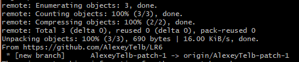
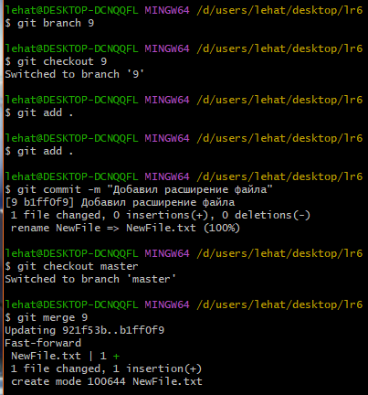

# LR6
Лабораторная работа №6

Цель лабораторной работы: изучение базовых возможностей системы управления версиями, опыт работы с Git Api, опыт работы с локальным и удаленным репозиторием.

Выполнение работы

* Клонировать свой личный удалённый репозиторий на компьютер.

```bash
git clone https://github.com/AlexeyTelb/LR6.git
```

 * Добавить файл через интерфейс GitHub. Подтянуть изменения в локальный репозиторий.

```bash
git pull
```

*  Получить историю операций для каждой из веток.

```bash
git log --graph
```

* Просмотреть последние изменения. 

```bash
git log
```

* Выполнить слияние в ветку master, разрешив конфликт. 

```bash
git merge origin/AlexeyTelb-patch-1
git branch 9
git checkout 9
git add . 
git commit 
git checkout master
git merge 
```

* Удалить побочную ветку после успешного слияния.

```bash
git branch -d 9
```

* Сделать изменения и зафиксировать их, оставляя комментарии ,несколько раз. 

```bash
git add . 
git commit
```

* Сделать откат коммита. 

```bash
git reset 
git log
```

* Создать ветку для отчёта.


```bash
git branch otchet
git checkout otchet
```


* Начать оформлять отчёт.


* Получить историю операций в форматированном виде.

* Отправить локальные изменения в сетевое хранилище GitHub

```bash
git log --pretty=format:"%h %ad %an %s"
```
* Отправить локальные изменения в сетевое хранилище GitHub
```bash
git push -u origin 
```